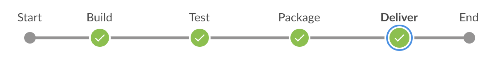

# Projet d'intégration continue 1

Projet d'intégration continue

## Consigne

Produire l'artefact HTML :
 
* d'un générateur de site statique (Mkdocs) 
* hébergés sur un SCM (Github) 
* avec un serveur d'integration (Jenkins).



## Point de départ

* https://www.mkdocs.org/#installation
* https://squidfunk.github.io/mkdocs-material/


### Procédure de départ

* Créer un conteneur Docker qui exécute mkdocs (Dockerfile)
* Dans le dossier, on dispose des fichiers source et et on exécute le conteneur contre le dossier pour générer le site Web
* On peut ensuite porter cette exécution dans jenkins.


### Jenkins

```
docker run --rm -u root -p 8080:8080 -v jenkins-data:/var/jenkins_home -v /var/run/docker.sock:/var/run/docker.sock jenkinsci/blueocean
```
